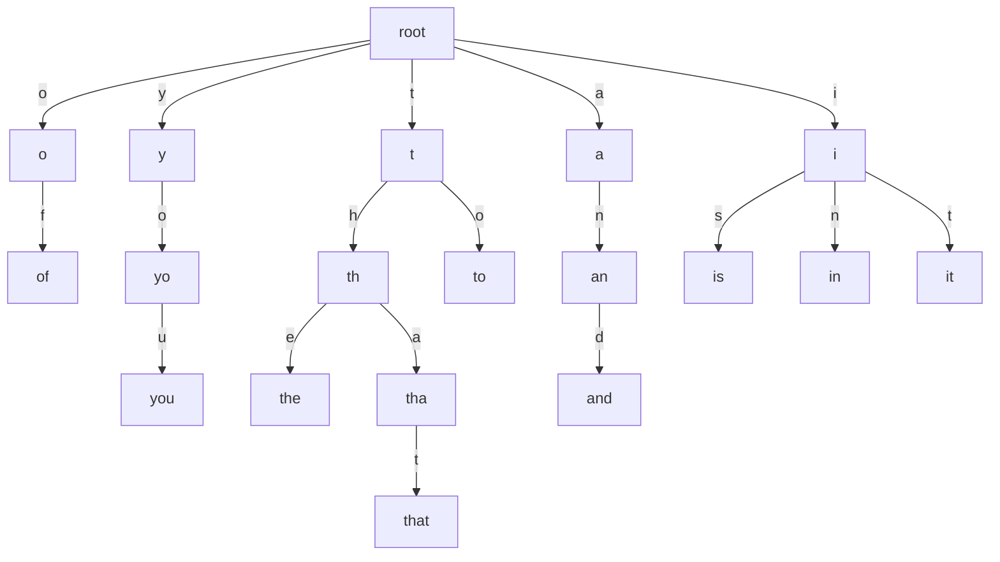

# Trie Visualization

```mermaid
graph TD
root --> |o| o
th --> |e| the
t --> |h| th
a --> |n| an
th --> |a| tha
i --> |s| is
yo --> |u| you
o --> |f| of
y --> |o| yo
root --> |y| y
root --> |t| t
root --> |a| a
t --> |o| to
i --> |n| in
i --> |t| it
root --> |i| i
tha --> |t| that
an --> |d| and
```
